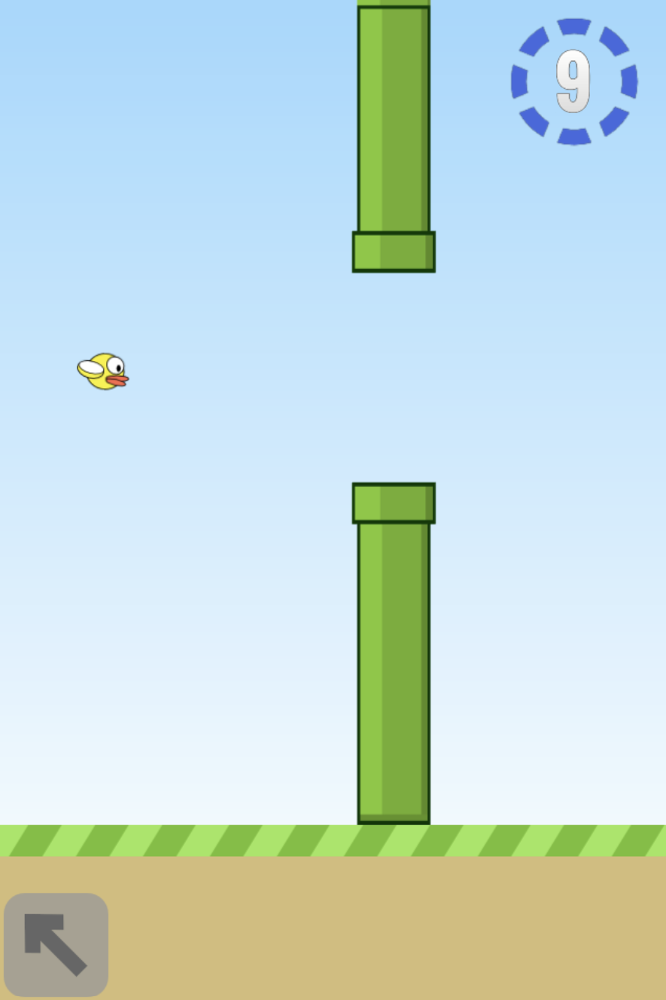
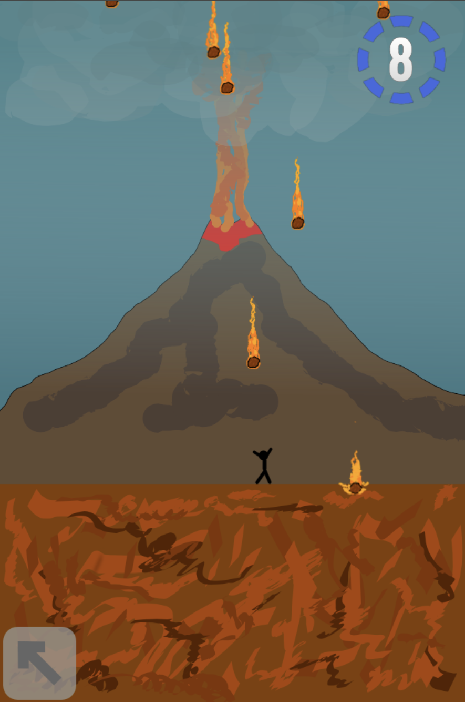

# Minigames

  
  

Live app: [santistebanc.github.io/minigames](https://santistebanc.github.io/minigames/)

Minigames is a fast-paced mobile arcade game built with Phaser.js. Each run drops you into a rotating series of 10-second challenges with different difficulty levels, and the goal is simple: survive, react quickly, and rack up the highest score you can.

The game is designed for mobile play, but it also runs in the browser on the web.
